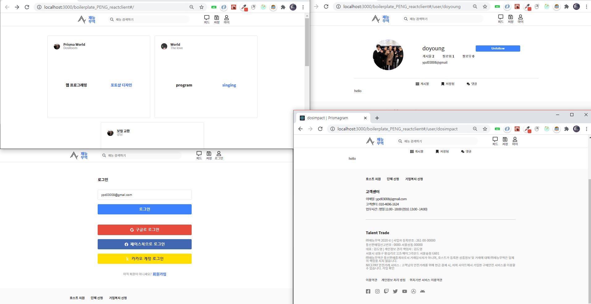

# 재능무역



# feature

- state 관리
- [ ] node.js 빠르게 HTTPS 적용시켜보기
- [ ] localState 저장 미들웨어 조사

- Auth
- [ ] 회원가입 기능
- [ ] 소셜 로그인 기능

- Post
- [ ] 포스트 모집완료 기능 추가
- [ ] Home 화면에서 인피니트 스크롤 완성하기
- [ ] Post 를 페이지네이션 쿼리 날리기.
- [ ] saved 기능을 만들어야 하나

- Profile
- [ ] 인스타 그램 클론 - 게시물, 저장됨, 피드?
- [ ] 프로파일 수정하기
- [ ] 없는 유저 url 왔을때 표시.

# 이슈

- [ ] 서버랑 연결불량일때 > frontPage가 공백
- [ ] 리덕스 컴포넌트 + 최적화

- [ ] popup 이슈
- 안보이는 div를 화면 전체가 덮고 그위에 pop 창을 올려 두어야한다.
-
- [ ] Header popup 뛰울때 다른곳 누르면 들어가도록 만들기 ( useEffect 에서 비슷한거 했었는데.)
- [ ] Home 로그인 , 첫화면에서도 로그인 누르면 popup이 나온다.

# 해결된 이슈

- [✔] react-router-dom 에서 push("/") 했을때 Home 컴포넌트의 data가 refetch안되던 이슈

- 원인 : apolloClient를 사용하면서 - caching 정책때문임.
- 해결 : fetchPolicy: "network-only",

- [✔] fixed auth presenter - 비로그인시 pop창 없이 바로 로그인화면

- [✔] 리덕스 컴포넌트 무한 로딩 이슈

- 원인 : 함수명 중복, 심지어 컴포넌트 무한로딩이 아니었음 (분석 실패)
- 해결 : handleLogOut ( button에 들어가는 이름), LogOutActionCreator 이름 짓기의 중요성

```js
const { data, loading, error } = useQuery(getAllPost, {
  fetchPolicy: "network-only",
});
```

# 개선사항 및 피드백

1. Loader 와 같은 모듈을 만드는것은 매우 좋다. MUI를 보니, 디자인 자체에 padding을 넣어서 w,h에 자유를 주고 padding으로 간격을 유지

## tag apolloclient update v3.0

- apolloclient update

```
npm install @apollo/client graphql @apollo/react-hooks
use instead of:
import { useQuery, useMutation, gql } from "@apollo/client";
```

## tag redux install

```
yarn add redux react-redux redux-promise redux-thunk
```
